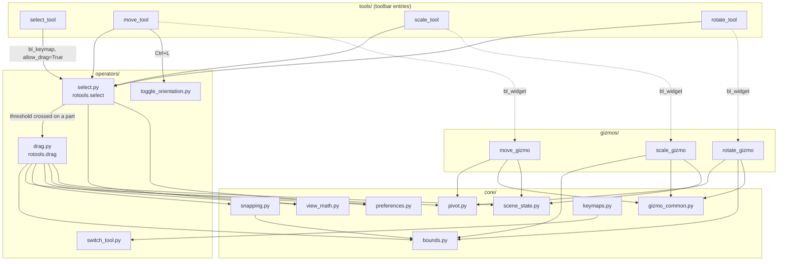
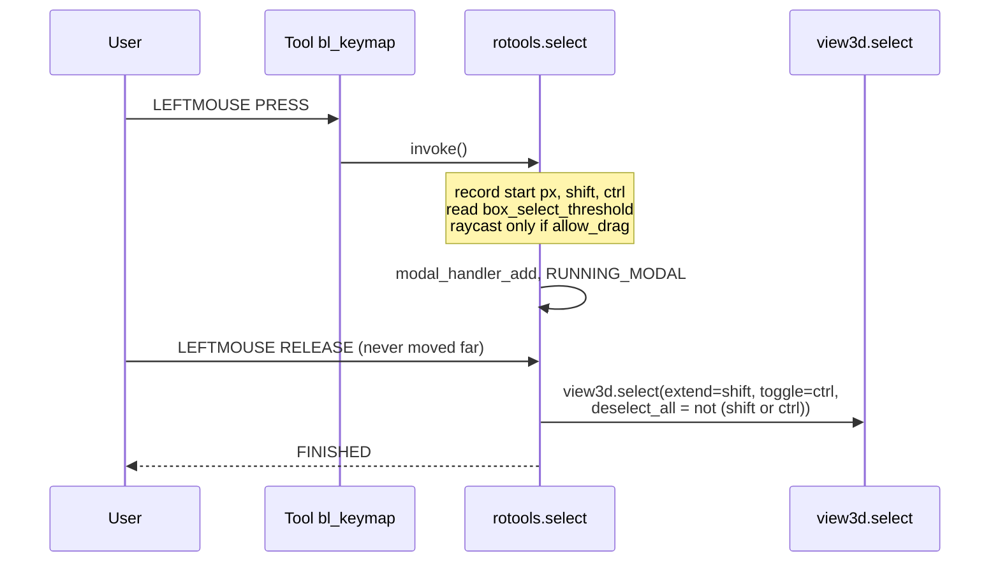
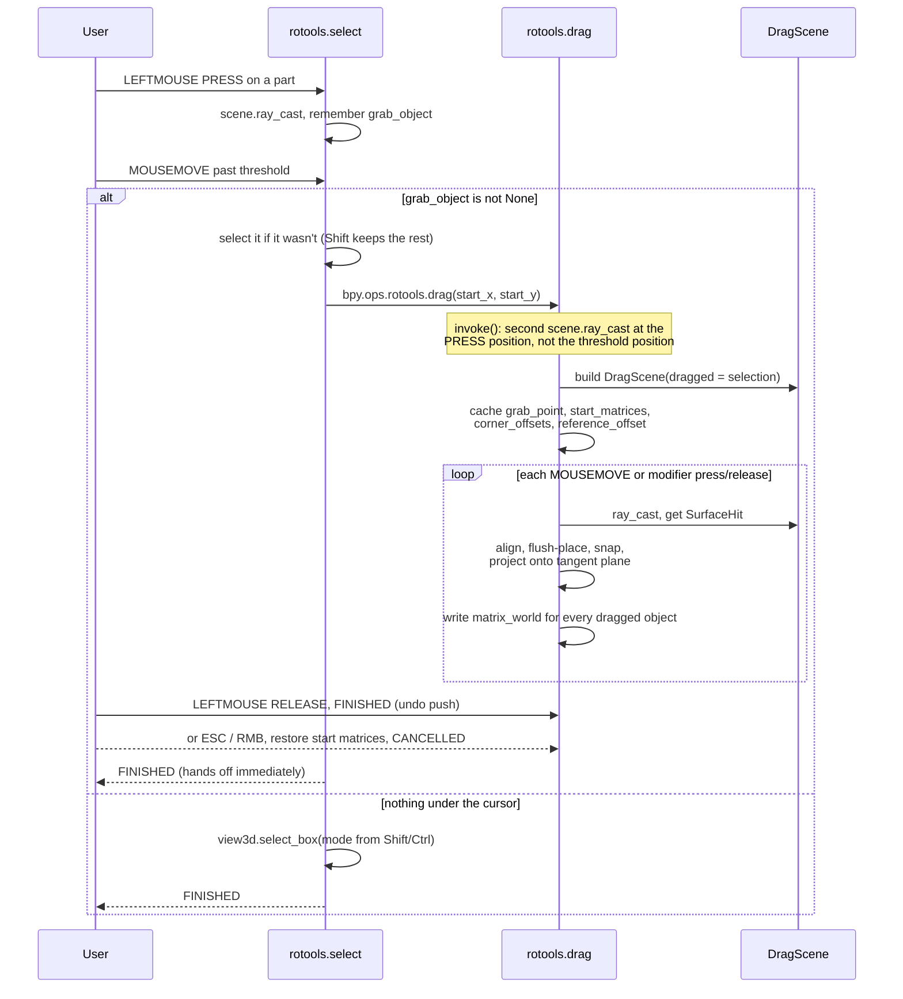

# 2. Architecture

## Package layout

```
roblox_tools/
├── __init__.py            bl_info, MODULES tuple, register/unregister
├── core/                  shared math, state, and two engines
│   ├── bounds.py          AABB construction, overlap and ray/slab tests
│   ├── gizmo_common.py    axis colours, axis rotations, local-basis helper
│   ├── keymaps.py         global Q/W/E/R and Ctrl+1..4 tool shortcuts
│   ├── picking.py         pick_element: one vertex/edge/face under the cursor
│   ├── pivot.py           pivot_point: Center / Origin / Swivel
│   ├── preferences.py     AddonPreferences + get_pref accessor
│   ├── scene_state.py     bpy.types.Scene properties
│   ├── snapping.py        DragScene: broad/narrow/fine phases + resolve_snap
│   └── view_math.py       screen <-> world; pixels_to_world
├── gizmos/                GizmoGroup subclasses
│   ├── move_gizmo.py      ROTOOLS_GGT_move
│   ├── scale_gizmo.py     ROTOOLS_GGT_scale
│   └── rotate_gizmo.py    ROTOOLS_GGT_rotate
├── operators/             bpy.types.Operator subclasses
│   ├── select.py          rotools.select  -- click / box / drag routing
│   ├── drag.py            rotools.drag    -- the free-drag modal operator
│   ├── toggle_orientation.py  rotools.toggle_orientation, rotools.cycle_pivot
│   ├── set_swivel.py          rotools.set_swivel, rotools.clear_swivel
│   └── switch_tool.py     rotools.switch_tool
├── tools/                 WorkSpaceTool subclasses (toolbar entries)
│   ├── select_tool.py     rotools.select_tool
│   ├── move_tool.py       rotools.move_tool
│   ├── scale_tool.py      rotools.scale_tool
│   └── rotate_tool.py     rotools.rotate_tool
└── ui/                    shared UI, no bpy.types.Panel anywhere
    ├── tool_ui.py         the settings rows every tool draws
    └── overlay.py         POST_VIEW handler: swivel marker + pick preview
```

`ui/` holds no `bpy.types.Panel`. Each tool's settings are still drawn by its
own `draw_settings` classmethod; `ui/tool_ui.py` just holds the rows all four
share, so the orientation and pivot controls cannot drift apart per tool the way
they did before. `ui/overlay.py` is the one piece of `gpu` drawing in the addon.

## Module dependency graph



Notes on the graph:

- `core/` has **no upward dependencies** — nothing in `core/` imports from
  `operators/`, `gizmos/`, or `tools/`.
- `core/bounds.py` is the single point of AABB truth, shared by the scale and
  rotate gizmos (rotated local frames) and by the dragger's broad phase (world
  frame). `world_aabb` is literally `local_aabb` in the identity frame
  ([bounds.py:44](../roblox_tools/core/bounds.py)).
- `core/snapping.py` depends only on `core/bounds.py` and `mathutils` — no
  `bpy.ops`, no UI coupling. It is the most testable module in the addon.
- Nothing imports `core/keymaps.py` except `__init__.py`; it is a pure
  side-effect module.

## Registration lifecycle

[`__init__.py:21`](../roblox_tools/__init__.py) defines a `MODULES` tuple;
`register()` walks it forward and `unregister()` walks it in reverse. Every
module exposes exactly `register()` / `unregister()`. **The order is
load-bearing:**

| # | Module | Why it must come here |
| --- | --- | --- |
| 1 | `preferences` | `AddonPreferences` must exist before anything reads `context.preferences.addons[...].preferences` |
| 2 | `scene_state` | Scene properties must exist before any tool's `draw_settings()` references them |
| 3 | `op_select` | — |
| 4 | `op_drag` | `rotools.drag` must be registered before `rotools.select` can invoke it |
| 5 | `op_toggle_orientation` | must exist before `move_tool`'s `bl_keymap` names it |
| 6 | `op_switch_tool` | must exist before `keymaps` binds to it |
| 7–9 | `move_gizmo`, `scale_gizmo`, `rotate_gizmo` | `GizmoGroup`s must be registered before a `WorkSpaceTool` names one in `bl_widget` |
| 10–13 | `select_tool`, `move_tool`, `scale_tool`, `rotate_tool` | each calls `register_tool(after={previous})`, so toolbar order depends on this exact sequence |
| 14 | `keymaps` | last: binds `rotools.switch_tool`, which must already exist |

`unregister()` reverses this, so keymap items are removed first and preferences
last — the correct teardown direction for the same reasons.

### The deferred rotate-increment default

`scene_state.register()` cannot set `snap_angle_increment_3d` inline because
`bpy.data` is unavailable during registration (restricted context). It defers
one tick via `bpy.app.timers.register(..., first_interval=0)`
([scene_state.py:71](../roblox_tools/core/scene_state.py)), and the callback
walks every scene in the file.

**Observation:** the timer is not cancelled in `unregister()`. It is a one-shot
(returns `None`, so it never reschedules), but a disable-then-reload completed
within the same tick would leave it queued against the old module.

## State ownership

State lives in exactly three places, chosen deliberately:

| Location | What lives there | Rationale |
| --- | --- | --- |
| **`bpy.types.Scene`** (`core/scene_state.py`) | Grid snap + size, soft snap, surface align, ground plane + height, move orientation, scale pivot | These describe *the thing being built*, so they belong to the `.blend` and travel with it |
| **`AddonPreferences`** (`core/preferences.py`) | Box-select drag threshold (px), soft-snap margin (px) | These describe *how the user likes the tool to feel*, so they are per-user, not per-file |
| **Operator instance attributes** | `grab_point`, `start_matrices`, `corner_offsets`, `reference_offset`, `drag_scene`, `snap_kind`, `margin_pixels` | Alive only for the span of one drag; never persisted |

The dragger's modifier keys (Shift, Alt) form a **fourth, deliberately
ephemeral** layer: they flip behaviour for the frames they are held and are
never written back into the scene toggles
([drag.py:190](../roblox_tools/operators/drag.py)).

Full property reference: [07-settings-reference.md](07-settings-reference.md).

## Event flow — a click that selects



## Event flow — a drag



### Why there are two raycasts

`rotools.select` raycasts on mouse-down to decide **up front** whether the drag
threshold should route to the dragger or to box-select
([select.py:32](../roblox_tools/operators/select.py)). `rotools.drag` raycasts
again in its own `invoke` so it stays independently invokable rather than
depending on state handed to it
([drag.py:86](../roblox_tools/operators/drag.py)).

That is two `scene.ray_cast` calls, but both happen **only on drag start** —
never per frame. The per-frame drop-target query uses `DragScene.ray_cast`
instead, for the reason in [05-snapping-engine.md](05-snapping-engine.md):
`scene.ray_cast` has no way to exclude objects, and the dragged geometry is
exactly what sits under the cursor.

### Why `rotools.select` finishes immediately after starting the drag

`_start_drag` calls `bpy.ops.rotools.drag('INVOKE_DEFAULT', ...)` and then
returns `{'FINISHED'}` from `modal`
([select.py:55-69](../roblox_tools/operators/select.py)). The drag operator
installs its own modal handler, so it owns the mouse from that point on; the
select operator getting out of the way is what keeps the two from both
consuming `MOUSEMOVE`.

## Delegation strategy

RoTools implements novel behaviour and delegates everything Blender already
does well:

| Behaviour | Delegated to |
| --- | --- |
| Click select, extend, toggle | `view3d.select` |
| Rubber-band select | `view3d.select_box` |
| Axis-constrained translate | `transform.translate` (via gizmo target operator) |
| Axis-constrained resize | `transform.resize` |
| Axis-constrained rotate | `transform.rotate` |
| Increment / element snapping for the gizmos | Blender's own `tool_settings.use_snap` |
| Toolbar placement, tool switching | `bpy.utils.register_tool`, `wm.tool_set_by_id` |

The only transform RoTools computes itself is the dragger's, because no
Blender operator does surface-resting placement.
