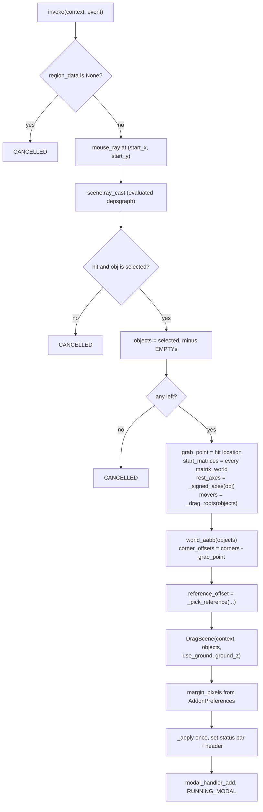
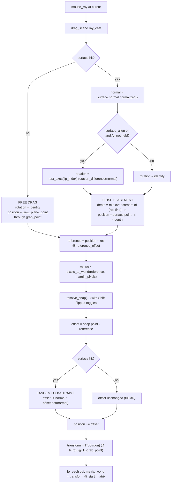

# 4. The Dragger (`rotools.drag`)

The free-drag operator is the addon's centrepiece and its only original
transform. Everything else delegates to a Blender operator; this does not,
because no Blender operator does surface-resting placement.

Source: [`roblox_tools/operators/drag.py`](../roblox_tools/operators/drag.py)
(295 lines).

---

## 4.1 It is the Select tool, not a tool of its own

In Roblox Studio the Select tool *is* the dragger. RoTools reproduces that
exactly: there is no "Roblox Drag" toolbar entry. `rotools.drag` is invoked
from `rotools.select` when the drag threshold is crossed while the press
landed on a part.

```
rotools.select_tool  ──LMB──▶  rotools.select (allow_drag=True)
                                    │
                        press landed on a part?
                            ├── yes ──▶ rotools.drag        (free-drag)
                            └── no  ──▶ view3d.select_box   (rubber band)
```

The Move / Scale / Rotate tools bind the same `rotools.select` operator but
leave `allow_drag` at its `False` default, so a body drag there does nothing
and cannot fight their gizmos.

### Operator declaration

```python
bl_idname  = "rotools.drag"
bl_label   = "Roblox Drag"
bl_options = {'REGISTER', 'UNDO', 'GRAB_CURSOR', 'BLOCKING'}
```

**Verified** meanings (Blender's `operator_type_flag_items`):

| Flag | Effect |
| --- | --- |
| `REGISTER` | Shows in the Info window, supports the redo panel |
| `UNDO` | Pushes an undo event on `FINISHED` — mandatory, since the operator writes `matrix_world` |
| `GRAB_CURSOR` | Grabs mouse focus; enables wrapping when continuous grab is on |
| `BLOCKING` | Blocks anything else from using the cursor |

`poll` requires `context.mode == 'OBJECT'` and a non-empty selection.

### Properties

| Property | Type | Purpose |
| --- | --- | --- |
| `start_x`, `start_y` | `IntProperty`, `HIDDEN` | The **press** position in region pixels |

These matter: the press position is a few pixels back from where the threshold
was crossed. Grabbing from the press position is what keeps the part from
jumping by the threshold distance on the first frame
([drag.py:68-72](../roblox_tools/operators/drag.py)).

---

## 4.2 `invoke` — building the grab state

Everything that will be reused per frame is computed once, here.



### The cached state, and why each piece is cached

| Attribute | What it is | Why cache it |
| --- | --- | --- |
| `grab_point` | World-space point the ray hit on the grabbed part | The whole selection travels rigidly relative to this |
| `start_matrices` | Every dragged object's `matrix_world` at grab time | Each frame recomputes from these, so nothing accumulates drift; also the cancel-restore source |
| `rest_axes` | The grabbed object's six signed local axes, most-upward first | Index `tip_index` is swung onto each new surface normal; `T` steps through the list |
| `movers` | `objects` minus any whose parent is also selected | The only objects actually written to |
| `tip_index` / `spin_steps` | `T` and `R` counters, both start at 0 | Re-derived into a rotation every frame |
| `stamps` | Copies left behind by `Ctrl+D` | Removed again if the drag is cancelled |
| `corner_offsets` | 8 selection-AABB corners, relative to `grab_point` | The flush-placement `min` runs over these every frame |
| `reference_offset` | The snap reference point, relative to `grab_point` | What snapping actually aligns |
| `drag_scene` | `DragScene` with its BVH + AABB caches | Built once; valid for the whole drag |
| `margin_pixels` | `soft_snap_margin` preference | Converted to world units per frame at the reference's depth |

`objects` excludes `type == 'EMPTY'`
(via `pivot.transform_objects`, shared with the gizmos). Empties have no geometry to
rest on a surface, and — **verified** in Blender 5.2.0 LTS — an Empty's
`bound_box` reads as eight zero vectors, so an included Empty would contribute
its origin as a spurious AABB corner.

### `_drag_roots` — only the roots get written

```python
def _drag_roots(objects):
    selected = set(objects)
    roots = []
    for obj in objects:
        parent = obj.parent
        while parent is not None:
            if parent in selected:
                break
            parent = parent.parent
        else:
            roots.append(obj)
    return roots
```

Bounds are measured over the whole selection; only objects with no *selected*
ancestor have their `matrix_world` written. Children ride along with their
parents, which is also what Blender's own transform does.

> **Verified in Blender 5.2** — this was a real bug, not a precaution. A child
> 2 units from its parent, both offset by +10 on X, landed at **X = 22**
> instead of 12 when the child's matrix was written first; parent-first gave
> the correct 12. Writing `matrix_world` on a child computes its local matrix
> against the parent's *current* matrix, so moving the parent afterwards
> applies the drag a second time. `context.selected_objects` gives no ordering
> guarantee, so which one you got was a coin flip.

### `_signed_axes` — surface align, and what `T` steps through

```python
def _signed_axes(matrix):
    rotation = matrix.to_3x3().normalized()
    axes = [rotation.col[i] * sign for i in range(3) for sign in (1.0, -1.0)]
    axes.sort(key=lambda axis: -axis.z)
    return axes
```

All six signed local axes, sorted most-upward first. **Index 0 is the axis the
part is currently resting on**, which is what surface align swings onto each new
normal — so at `tip_index = 0` this is exactly the previous `_resting_axis`
behaviour. The rest of the list is what `T` cycles through, which is how tipping
changes *which face* ends up against the surface.

**Why the resting axis and not the clicked face's normal:** using the resting
axis is what makes a part dragged off the floor onto a wall **tip over and lie
against the wall**. If the clicked face's normal were used instead, the part
would spin according to where you happened to grab it.

### `_pick_reference` — corner, or pivot

The reference point is what snapping aligns. By default it is the AABB corner
nearest the click, so grabbing a part by its top-left corner snaps *that
corner*. But if the press landed within `PIVOT_GRAB_PIXELS` (12 px) of the
selection pivot, the pivot is used instead as a zero-size reference
([drag.py:123-141](../roblox_tools/operators/drag.py)).

The pivot proximity test is done in **screen space** via `point_to_region`,
which is why it is a pixel constant rather than a world distance.

---

## 4.3 `_apply` — the per-frame placement pipeline

This runs on every `MOUSEMOVE` and on every modifier press/release. It is the
heart of the operator.



### Step 1 — the drop target

`drag_scene.ray_cast(origin, direction)` returns the nearest `SurfaceHit`,
excluding the dragged objects and including the synthetic ground plane. See
[05-snapping-engine.md](05-snapping-engine.md).

If it returns `None` (ground plane off, nothing else in the way), the operator
falls back to a **free drag**: the part slides on the camera-facing plane
through the original grab point, orientation untouched, and steps 2–3 are
skipped entirely.

### Step 2 — surface align

```python
rotation = self.rest_axes[self.tip_index].rotation_difference(up)
```

**Verified**: `Vector.rotation_difference(other)` returns "a quaternion
representing the rotational difference between this vector and another"
(`mathutils.Vector`). So `rotation` is the minimal swing taking the part's
resting axis onto the new surface's normal.

Skipped — leaving `rotation` as the identity quaternion — when
`rotools_drag_surface_align` is off, or when **Alt** is held.

### Step 3 — the flush-placement derivation

This is the piece worth not re-deriving. Let:

- **o**<sub>i</sub> = the *i*th AABB corner offset, relative to the grab point
- **q** = the align rotation
- **n** = the surface normal (unit)
- **s** = the surface hit point
- **p** = the final position of the grab point

The code computes:

```python
depth    = min((rotation @ offset).dot(normal) for offset in self.corner_offsets)
position = surface.point - normal * depth
```

That is:

> d = min<sub>i</sub> ( (**q o**<sub>i</sub>) · **n** ) &nbsp;&nbsp;&nbsp;&nbsp;
> **p** = **s** − d **n**

**Why this rests the box flush.** The rigid transform maps the grab point to
**p** and each corner to **p** + **q o**<sub>i</sub>. Project a corner onto the
normal:

> (**p** + **q o**<sub>i</sub>) · **n** = **p**·**n** + (**q o**<sub>i</sub>)·**n**

Take the minimum over *i* — the lowest corner relative to the surface:

> **p**·**n** + d = (**s** − d**n**)·**n** + d = **s**·**n** − d + d = **s**·**n**

The lowest corner lands **exactly** in the plane through **s** with normal
**n**. No penetration, no gap.

**Why the grab point stays under the cursor.** Only the normal component of the
position moves — the tangential components of **s** are untouched — so the
part slides with the mouse rather than snapping its centre to the cursor.

**Verified in Blender** (recorded in `PROJECT_NOTES.md`): grabbing a cube by
its **top** face still rests its **bottom** on the surface. The grab point must
never become the resting point, and this formula is what guarantees it.

### Step 4 — snapping, and the tangent-plane constraint

```python
reference = position + (rotation @ self.reference_offset)
radius    = pixels_to_world(region, rv3d, reference, self.margin_pixels)
snap      = resolve_snap(...)
offset    = snap.point - reference
if surface is not None:
    offset -= normal * offset.dot(normal)   # <-- load-bearing
position += offset
```

The single least obvious line in the file, and the one most likely to be
"simplified" back into a bug.

**The problem it solves.** Step 3 already put the box *exactly* flush. Adding a
raw 3D snap offset on top of that undoes it. Measured before the constraint was
added, on a 1×1×1 cube dropped on a slab whose top face is at z = 0.5
(`PROJECT_NOTES.md`):

| Snap kind | Result without the constraint |
| --- | --- |
| Vertex, toward a vertex just under the surface | Box bottom driven to **z = 0.1** — 0.4 units *sunk into the slab* |
| Grid | Box bottom driven to **z = 0.0** — rounding lifted the box off the surface to a round Z |

**The fix.** Project the offset onto the surface's tangent plane. The box still
slides in the surface's own plane toward the snap target, the reported snap
kind is unchanged, but **flush contact becomes an invariant snapping cannot
break**.

**Why `FACE` is safe in `SNAP_PRIORITY`.** The offset to the nearest point on
the surface you are already resting on is purely along the normal, so the
projection leaves exactly zero. `FACE` is a principled no-op rather than a
hazard.

**Why free-drag is exempt.** With no surface there is no tangent plane and no
flush placement to preserve, so free-drag snapping stays unconstrained 3D —
which is correct.

> Do **not** collapse this back to `position += snap.point - reference`.

### Step 5 — one rigid transform

```python
transform = (
    Matrix.Translation(position)
    @ rotation.to_matrix().to_4x4()
    @ Matrix.Translation(-self.grab_point)
)
for obj, start in zip(self.movers, self.start_matrices):
    obj.matrix_world = transform @ start
```

Read right to left: move the grab point to the origin, rotate about it, then
carry it to the new position. Applied on top of each object's **start** matrix,
which is what preserves per-object scale, per-object rotation, and the relative
offsets within a multi-object selection.

Because every frame recomputes from `start_matrices` rather than from the
previous frame, the drag accumulates no floating-point drift and cancelling is
a straight assignment back.

---

## 4.4 Modifier keys

### `_modifiers` — and why you must not read `event.shift` directly

```python
@staticmethod
def _modifiers(event):
    shift, alt = event.shift, event.alt
    if event.type in {'LEFT_SHIFT', 'RIGHT_SHIFT'}:
        shift = event.value == 'PRESS'
    elif event.type in {'LEFT_ALT', 'RIGHT_ALT'}:
        alt = event.value == 'PRESS'
    return shift, alt
```

`event.shift` still reads `True` on the `LEFT_SHIFT` **release** event that
turns it off. On a modifier key's own event, `event.value` is the authority.
Reading `event.shift` directly in `_apply` would leave the part stuck in the
shifted state for one extra frame.

### Shift — invert snapping

```python
flip = shift
use_soft = (scene.rotools_drag_soft_snap != flip) and surface is not None
use_grid = scene.rotools_drag_grid_size > 0.0 and (scene.rotools_drag_grid_snap != flip)
```

`!=` on booleans is XOR: Shift flips each toggle for exactly as long as it is
held, and the scene properties are never written. Concretely, with the shipped
defaults (grid on, soft on):

| Held | Grid | Soft | Result |
| --- | --- | --- | --- |
| — | on | on | Grid snap wins (hard snap outranks soft) |
| `Shift` | off | off | **Free placement** — `resolve_snap` returns `kind=None` |

And with both toggles turned off in the UI:

| Held | Grid | Soft | Result |
| --- | --- | --- | --- |
| — | off | off | Free placement |
| `Shift` | on | on | **Grid snap** |

Note `use_soft` additionally requires `surface is not None`: soft snapping to
scene geometry is only offered when the part is actually resting on something.

### Alt — keep orientation

Skips the surface-align rotation for as long as it is held, leaving `rotation`
as the identity quaternion. The flush placement still runs, so the part still
rests on the surface — it just does not tip over onto it.

### R and T — spin and tip

```python
up = WORLD_UP if surface is None else surface.normal.normalized()

aligning = surface is not None and scene.rotools_drag_surface_align and not alt
if aligning or self.tip_index != 0:
    resting  = self.rest_axes[self.tip_index % len(self.rest_axes)]
    rotation = resting.rotation_difference(up)
else:
    rotation = Quaternion()

if self.spin_steps % 4:
    rotation = Quaternion(up, QUARTER_TURN * self.spin_steps) @ rotation
```

| Key | Effect |
| --- | --- |
| `R` | Spin 90 degrees about the drop surface's normal — world +Z when free-dragging, so a spin still means something in mid-air |
| `T` | Tip onto the next of the object's six faces |

Both are modelled as *state* (which resting axis, how many quarter turns)
re-derived into a rotation every frame, rather than as an accumulating
quaternion. That is what keeps the flush placement exact: the depth solve
already runs on the final `rotation`, so a spun or tipped part still rests
exactly on the surface, with no penetration and no gap.

**`T` implies alignment even when the Align toggle is off** (the `or
self.tip_index != 0`). Tipping is a request to put a specific face against the
surface; refusing to align it would make the key do nothing.

### Ctrl+D — stamp

Leaves a copy of the selection at the current position and keeps dragging the
original. Full copies, matching what `Ctrl+D` means everywhere else in Blender:

```python
copy = obj.copy()
if obj.data is not None:
    copy.data = obj.data.copy()
for collection in obj.users_collection:
    collection.objects.link(copy)
```

There is no matrix work — `obj.copy()` carries the transform, so the copy is
already coincident. The only fix-up is re-pointing parents that were themselves
copied, so the stamp is self-contained rather than hanging off parts still being
dragged.

Cancelling the drag removes the stamps *and* the data they orphaned:

```python
data = [obj.data for obj in self.stamps if obj.data is not None]
bpy.data.batch_remove(self.stamps)
bpy.data.batch_remove([block for block in data if block.users == 0])
```

**Verified end to end**: a parent + child selection stamped 2 objects, the child
copy was parented to the *parent copy*, both meshes were genuinely copied, and
discarding freed both objects and both meshes.

---

## 4.5 The modal contract

| Event | Action | Return |
| --- | --- | --- |
| `RIGHTMOUSE` or `ESC` | `_restore()` — start matrices back, stamps discarded — clear status + header | `CANCELLED` |
| `LEFTMOUSE` `RELEASE` | Clear status + header | `FINISHED` (undo pushed) |
| `MOUSEMOVE` | `_apply` + refresh header | `RUNNING_MODAL` |
| `LEFT_SHIFT` / `RIGHT_SHIFT` / `LEFT_ALT` / `RIGHT_ALT` (press *or* release) | `_apply` + refresh header | `RUNNING_MODAL` |
| `R` press | `spin_steps += 1`, `_apply` | `RUNNING_MODAL` |
| `T` press | `tip_index += 1` (mod 6), `_apply` | `RUNNING_MODAL` |
| `Ctrl+D` press | `_stamp()`, `_apply` | `RUNNING_MODAL` |
| anything else | ignored | `RUNNING_MODAL` |

The cancel and confirm cases are tested **first**, so `RIGHTMOUSE` / `ESC`
cannot be swallowed by the key-press block below them.

Re-applying on the modifier event itself — rather than waiting for the next
`MOUSEMOVE` — is what makes the part update the instant Shift goes down. Without
it the tool feels inert until you nudge the mouse.

### Status bar and header

```python
context.workspace.status_text_set(self._status_draw)   # a callable
context.area.header_text_set(f"Drag  |  Snap: {label}")
```

**Verified**: `WorkSpace.status_text_set(text)` — "When text is a function,
this will be called with the (header, context) arguments." Passing a callable
is what allows the `EVENT_*` / `MOUSE_*` icons Blender's own modal tools use;
a plain string gets no icons.

The status row reads:

```
🖱 Confirm  ⎋ Cancel  ⇧ Free / Snap  ⎇ Keep Orientation  R Spin 90  T Tip Over  D Stamp Copy
```

The area header carries a live readout of *which rule placed the object* and
where it landed:

```
Drag  |  Snap: Vertex  |  X 3.000  Y -1.000  Z 0.500  |  Spin 90  |  Tipped  |  Stamped 2
```

The snap kind is one of `Vertex`, `Edge`, `Face`, `Grid`, or `Free`. The spin,
tip and stamp segments appear only once they apply.

**Both must be cleared on `FINISHED` and on `CANCELLED`**, or the hints stay on
screen after the drag ends. `_status_clear` does both
(`drag.py:_status_clear`).

---

## 4.6 Cross-references

- The collision queries, caches, ground plane, and snap precedence:
  [05-snapping-engine.md](05-snapping-engine.md)
- `pixels_to_world` and why every threshold goes through it:
  [05-snapping-engine.md](05-snapping-engine.md#55-screen--world-conversion)
- The scene toggles this operator reads:
  [07-settings-reference.md](07-settings-reference.md)
- Remaining unbuilt tiers (`blf`/`gpu` HUD, animated tilt, per-object
  collidable filtering): [11-known-gaps.md](11-known-gaps.md)
