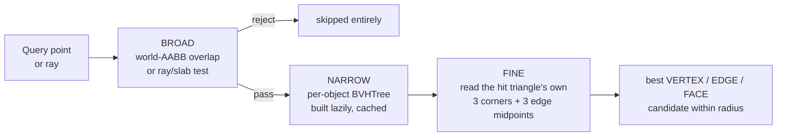

# 5. The Snapping Engine

The dragger's engine lives in three `core/` modules with no `bpy.ops`
dependency and no UI coupling:

| Module | Role |
| --- | --- |
| [`core/snapping.py`](../roblox_tools/core/snapping.py) | `DragScene` (collision + caches), `resolve_snap` (precedence) |
| [`core/bounds.py`](../roblox_tools/core/bounds.py) | AABB construction, overlap test, ray/slab test |
| [`core/view_math.py`](../roblox_tools/core/view_math.py) | screen ↔ world, and `pixels_to_world` |

---

## 5.1 Why not `scene.ray_cast`?

`bpy.types.Scene.ray_cast` **has no way to exclude objects**, and during a drag
the geometry directly under the cursor is exactly the geometry being dragged.
Using it per frame would make every part collide with itself.

Hence `DragScene`, which owns the candidate list and its own per-object
`BVHTree`s.

The mouse-down *grab* raycast in `rotools.drag.invoke` **does** use
`scene.ray_cast` — at that moment nothing needs excluding, and the built-in is
both faster and depsgraph-correct.

---

## 5.2 The three phases



Cheapest first. Each stage exists to keep the next one off the hot path.

### Broad phase — `core/bounds.py`

Two cheap rejects, both pure math on 6 floats:

| Function | Used by | What it does |
| --- | --- | --- |
| `aabb_overlap(min_a, max_a, min_b, max_b)` | `nearest_features` | Interval overlap on all three axes |
| `ray_hits_aabb(origin, direction, mins, maxs)` | `ray_cast` | Standard slab test; handles the axis-parallel case explicitly with a `1e-9` epsilon, and rejects hits entirely behind the origin (`t_far < 0`) |

World AABBs come from `world_aabb(objects)`, which is `local_aabb` in the
identity frame — the same corner-walk the scale gizmo uses for rotated frames,
deliberately not duplicated ([bounds.py:37-45](../roblox_tools/core/bounds.py)).

`local_aabb` walks each object's `obj.bound_box` corners through
`obj.matrix_world` and projects onto the frame's axes.

> **Verified** in Blender 5.2.0 LTS: `obj.bound_box` on the *original* object
> already reflects modifier-evaluated bounds. A plane with a 4-unit Solidify
> reported a Z range of −2 … 2 on `obj.bound_box`, identical to
> `obj.evaluated_get(depsgraph).bound_box` and to the evaluated mesh's own
> vertex range. So the broad phase (base object) and the narrow phase
> (evaluated mesh) agree — this is *not* a source of missed collisions.

### Narrow phase — the per-object BVH

```python
def _build_tree(obj, depsgraph):
    eval_obj = obj.evaluated_get(depsgraph)
    mesh = eval_obj.to_mesh()
    if mesh is None:
        return None
    mesh.calc_loop_triangles()
    matrix = obj.matrix_world
    verts = [matrix @ v.co for v in mesh.vertices]   # fresh Vectors
    tris  = [tuple(tri.vertices) for tri in mesh.loop_triangles]
    eval_obj.to_mesh_clear()
    if not tris:
        return None
    return BVHTree.FromPolygons(verts, tris, all_triangles=True), verts, tris
```

Four decisions worth keeping:

1. **World space, not local.** One transform at build time buys two things: the
   hot loop never converts between spaces, and a BVH face index maps *directly*
   back to the three world-space corners of that triangle.
2. **`matrix @ v.co` returns fresh `Vector`s**, so `verts` outlives the
   `to_mesh_clear()` on the next line.
3. **`all_triangles=True`** — **verified** in `mathutils.bvhtree.BVHTree`:
   "Use when all polygons are triangles for more efficient conversion."
   `calc_loop_triangles()` guarantees the precondition.
4. **`None` on unusable input** — no mesh, or a mesh with no faces (a curve
   with no surface, an empty mesh). Callers skip those objects.

**Cache lifetime is exactly one drag.** `DragScene` is constructed in
`rotools.drag.invoke` and discarded when the operator ends. That is valid
because nothing except the dragged objects moves during a drag — so the trees
never need rebuilding, and they are never rebuilt per frame.

Both caches are lazy and keyed by `obj.name`:

| Cache | Populated by | Contents |
| --- | --- | --- |
| `_aabbs` | `DragScene.aabb(obj)` | `(Vector min, Vector max)` |
| `_trees` | `DragScene.tree(obj)` | `(BVHTree, verts, tris)` or `None` |

`_trees` uses `if obj.name not in self._trees` rather than a `.get()` default,
so a cached `None` (an unusable object) is remembered and not retried.

### Fine pass — the coarse → fine handoff

This is what makes vertex and edge snapping cheap:

```python
location, _normal, index, distance = tree.find_nearest(point, radius)
_keep_closest(found, 'FACE', location, distance)

a, b, c = (verts[i] for i in tris[index])
for corner in (a, b, c):
    _keep_closest(found, 'VERTEX', corner, (corner - point).length)
for start, end in ((a, b), (b, c), (c, a)):
    midpoint = (start + end) * 0.5
    _keep_closest(found, 'EDGE', midpoint, (midpoint - point).length)
```

**One `find_nearest` per candidate object buys all three snap kinds.** The BVH
narrows a whole object down to one triangle; then that triangle's own corners
and edge midpoints are read straight out of the cached world-space geometry.
No second query, no per-vertex scan.

**Verified** `BVHTree.find_nearest(origin, distance)` returns
`(position, normal, index, distance)`, all `None` on a miss, and `index` is the
polygon index — which indexes `tris` directly because the tree was built from
that same list.

Because the vertex and edge distances are measured *after* the fact, they can
exceed `radius` even though the face hit did not. The final line filters them:

```python
return {kind: hit for kind, hit in found.items() if hit[1] <= radius}
```

### Candidate selection

```python
self.candidates = [
    obj for obj in context.view_layer.objects
    if obj.type == 'MESH'
    and obj.name not in dragged_names
    and obj.visible_get()
]
```

Meshes only, visible only, dragged objects excluded. There is no per-object
"collidable" flag — that was Tier 6 and is not built.

---

## 5.3 The synthetic ground plane

```python
def _ground_ray(self, origin, direction):
    if not self.use_ground or abs(direction.z) < 1e-9:
        return None
    distance = (self.ground_z - origin.z) / direction.z
    if distance <= 0.0:
        return None
    return SurfaceHit(origin + direction * distance,
                      Vector((0.0, 0.0, 1.0)), GROUND, distance)
```

An **analytic, infinite, Z-up plane** — not a mesh quad.

**Why analytic:** a finite baseplate stand-in would have edges you could slide
off, and the dragger would suddenly have nothing to land on. Infinite means
there is always a surface.

**Consequences of having no geometry:** the ground has no vertices and no
edges, so it participates in **face and grid snapping only**. Vertex and edge
snapping never fire against it.

`GROUND` is a module-level string sentinel used as `SurfaceHit.obj`, since
there is no `bpy.types.Object` behind the plane.

`direction` **must be normalized** so the BVH's distances and the plane's
analytic distance are comparable — `mouse_ray` guarantees this, since
`region_2d_to_vector_3d` returns a unit vector.

---

## 5.4 Snap precedence — `resolve_snap`

```python
def resolve_snap(drag_scene, reference, radius, grid_size, use_soft, use_grid):
    if use_grid and grid_size > 0.0:
        return SnapResult('GRID', snap_to_grid(reference, grid_size))
    if use_soft:
        found = drag_scene.nearest_features(reference, radius)
        for kind in SNAP_PRIORITY:          # ('VERTEX', 'EDGE', 'FACE')
            hit = found.get(kind)
            if hit is not None:
                return SnapResult(kind, hit[0])
    return SnapResult(None, reference.copy())
```

### Decision table

| `use_grid` | `grid_size` | `use_soft` | Result |
| --- | --- | --- | --- |
| on | > 0 | *(irrelevant)* | `GRID` — exact multiple on every axis |
| on | 0 | on | falls through to the soft pass |
| off | — | on | best of `VERTEX` → `EDGE` → `FACE` within `radius`, else `None` |
| off | — | off | `None`, reference returned untouched |

### Hard grid snap outranks soft snap — and why that reversed

The first implementation checked soft snap first, letting geometry always win.
**That was wrong**, and the bug report was concrete: increment set to 1, yet
dragged parts landing hundredths off — a screenshot showed `Location X -1.06,
Y -0.03` with Soft Snap enabled.

Root cause, reproduced exactly with a neighbour cube parked at
`(1.06, 0.03, 1.0)`: soft snap ran first, so any vertex within the margin won
and dragged the result to that neighbour's arbitrary position. The reference
point snapped to its vertex at `(0.06, -0.97, 0)` instead of the grid's
`(0, -1, 0)`.

> **An increment that silently loses to a nearby vertex is not an increment.**

The source priorities document contains both "soft snap … *when hard snap is
off*" and "vertex > edge > face > grid fallback". Those reconcile as: the first
sentence governs *between* the two systems, the second governs ordering
*within* the soft pass. `resolve_snap` implements exactly that.

(In the reported case Z read as an exact 1 m even while X/Y were off, because
Z comes from the flush-placement step, not from snapping.)

### Snap kinds

`SNAP_PRIORITY = ('VERTEX', 'EDGE', 'FACE')` — best to worst. A corner always
wins over an edge, an edge over a flat face, and the grid only gets a say when
no geometry is close enough to matter.

`SnapResult.kind` is one of `'VERTEX'`, `'EDGE'`, `'FACE'`, `'GRID'`, or
`None`. The dragger surfaces it verbatim in the area header, so it is always
visible *which rule placed the object*.

---

## 5.5 Screen ↔ world conversion

Every threshold a user perceives as "a few pixels" must be converted through
the **current** view, or it behaves completely differently zoomed in than
zoomed out. `core/view_math.py` is the only place that conversion happens.

> **Project rule:** every pixel-based threshold goes through `pixels_to_world`.
> Never hardcode a flat world-space margin. (`CLAUDE.md`)

| Function | Wraps | Used for |
| --- | --- | --- |
| `mouse_ray(region, rv3d, coord)` | `region_2d_to_origin_3d` + `region_2d_to_vector_3d` | Every raycast; direction comes back **normalized** |
| `view_plane_point(region, rv3d, coord, depth_point)` | `region_2d_to_location_3d` | Free-drag on the camera-facing plane |
| `point_to_region(region, rv3d, point)` | `location_3d_to_region_2d` | The 12 px pivot-grab test |
| `pixels_to_world(region, rv3d, point, pixels)` | *(derived, see below)* | The soft-snap margin |

### The `pixels_to_world` derivation

```python
m11 = rv3d.window_matrix[1][1]
if m11 == 0.0 or region.height == 0:
    return 0.0
depth = 1.0
if rv3d.is_perspective:
    depth = max(-(rv3d.view_matrix @ point).z, 1e-6)
return pixels * 2.0 * depth / (m11 * region.height)
```

Derived from the window matrix rather than tuned by eye:

- `window_matrix[1][1]` is `1 / tan(fovy / 2)` for a perspective view and
  `2 / view_height` for an orthographic one.
- NDC's `[-1, 1]` range covers `region.height` pixels.
- Therefore one pixel spans `2 * depth / (m11 * region.height)` world units.
- Depth is pinned to `1` for orthographic views, which have no perspective
  divide.
- View space looks down −Z, so the perspective depth is negated to get a
  positive distance, and floored at `1e-6` to avoid a divide-by-zero at the
  eye plane.

The two guards (`m11 == 0.0`, `region.height == 0`) return `0.0`, which
degrades to "no soft-snap margin" rather than raising.

---

## 5.6 Data types

```python
class SurfaceHit:
    __slots__ = ('point', 'normal', 'obj', 'distance')

class SnapResult:
    __slots__ = ('kind', 'point')
```

Both use `__slots__` — they are allocated per frame in the hot loop, and slots
avoid a per-instance `__dict__`.

`SurfaceHit.obj` is either a `bpy.types.Object` or the `GROUND` sentinel
string.

`_keep_closest(found, kind, point, distance)` stores `point.copy()`, so the
result never aliases a cached `verts` entry that a caller might mutate.
